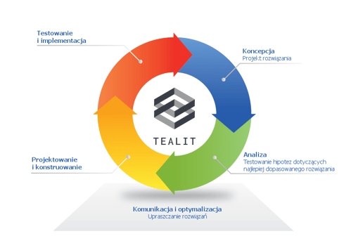

<a href="https://tealit.pl"><b>Tealit</b></a> to rozwiązania jakich potrzebuje Twoja firma.

## Historia naszej działalności

Tealit to zespół osób które są zaangażowane w niesienie pomocy w zakresie oprogramowania enova. Przez stały kontakt i szybką reakcję helpdesku dajemy Ci poczucie bezpieczeństwa.
Podejście do klienta jako partnera biznesowego pomaga w osiąganiu wymiernych korzyści, które uzyskujemy dzięki dostarczaniu nowoczesnego oprogramowania dla średnich i dużych firm z branż produkcyjnych, handlowych i usługowych, które są zainteresowane minimalizacją kosztów i skutecznym zarządzaniem. Jesteśmy  wiodącym dostawcą nowoczesnego systemu informatycznego,  opartego na biznesowym oprogramowaniu enova365. System został stworzony przez ekspertów z dziedzin zarządzania, finansów i księgowości, handlu oraz kadr i płac, a doceniło go już kilka tysięcy firm z całej Polski. Dzięki wieloletniemu doświadczeniu na rynku IT, zapewniamy profesjonalne doradztwo, wdrożenia a także dbałość o optymalne wykorzystanie istniejącej infrastruktury informatycznej. Wspieramy klientów chcących przejść na następny poziom rozwoju osobistego i biznesowego, poprzez budowanie zmotywowanym zespołem trwałych i efektywnych rozwiązań systemowych, przynoszących pozytywną zmianę rzeczywistości.

<a href="{{ site.url }}/enova365/">Co to jest enova365?</a>
 
## Wizja
Pragniemy pozytywnie zmieniać rzeczywistość budując trwałe i efektywne rozwiązania systemowe.
 
## Misja
Wspierać klientów w przejściu na następny poziom rozwoju osobistego i biznesowego na wszystkich rozwiniętych rynkach do połowy XXI wieku.
 
## Wartości
W codziennej pracy i życiu kierujemy się następującymi wartościami:
<ol>
  <li>Podążanie naprzód</li>
  <li>Szacunek dla istot i zdarzeń</li>
  <li>Zaangażowanie osobiste i zespołowe</li>
  <li>Działanie kreatywne, staranne i efektywne</li>
</ol>

## Sposób pracy i współpracy z klientem

<ul>
<li>Koncepcja - ustalenie stanu bieżącego, opracowanie listy wymagań krytycznych dla planowanych rozwiązań</li>
<li>Analiza - dogłębne sprawdzenie wypracowanego rozwiązania. W sytuacjach wątpliwych, które zostaną ujawnione podczas analizy, powrót do prac koncepcyjnych</li>
<li>Projektowanie i konstruowanie - wypracowane i przeanalizowane koncepcje zostają przełożone na projekt działających rozwiązań systemowych</li>
<li>Testowanie i implementacja - produkcyjne testowanie funkcjonującego rozwiązania systemowego. Dzięki naszemu podejściu, mamy zagwarantowaną możliwość dalszego dokonywania zmian, a w sytuacjach uzasadnionych powrotu do procesu tworzenia koncepcji</li>
<li>Komunikacja i optymalizacja – permanentne procesy efektywnej komunikacji oraz poszukiwania najprostszych rozwiązań</li>
</ul>

<!--## Podgląd Enova365


https://www.enova.pl/content/uploads/2018/03/str_gl_mock_up.png    
https://www.enova.pl/content/uploads/2017/12/aplikacje-i-przedstawiciel.png

-->
