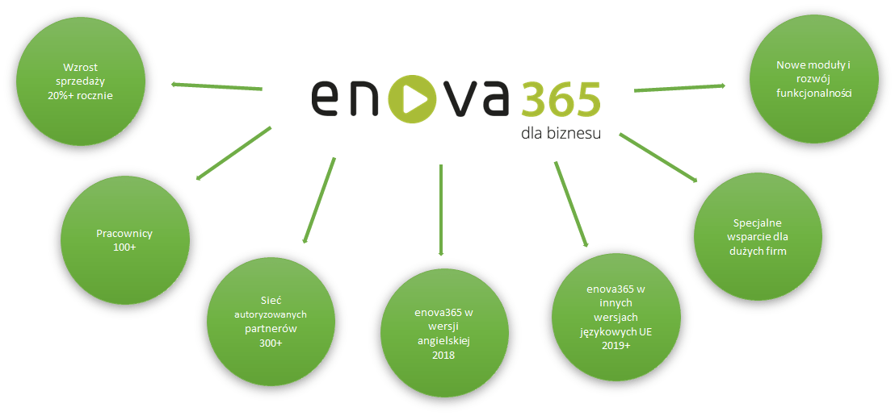

## Soneta Sp. z o.o., producent enova365

Soneta Sp. z o.o. jest polskim producentem oprogramowania do zarządzania – enova365. Spółka powstała w 2002 roku i od tego czasu nieustająco się rozwija. Jako pierwsza w Polsce udostępniła pełny system ERP w chmurze oraz umożliwiła swoim użytkownikom korzystanie z systemu na wielu urządzeniach (w tym tabletach i smartfonach). Aż 88% Klientów jest zadowolonych z użytkowania oprogramowania enova365
## Soneta Sp. z o.o., osiągnięcia, nagrody i wyróżnienia

<table>
<tr>
<th>
  <ol>
    <li>IT Leader Award w kategorii ERP (2018, 2017, 2016 - IT Future)</li>
    <li>Nagroda Diamenty Forbesa (2017, 2016 - Forbes)</li>
    <li>Gazela Biznesu (2017 - Puls Biznesu)</li>
    <li>Tytuł Partnera Microsoft roku w kategorii aplikacja (2014 - Microsoft)</li>
    <li>European Quality Certificate® (2014, 2011 - Fundacja Qualitas)</li>
    <li>Certyfikat Innowacja Roku (2014, 2011 - Fundacja Centrum Innowacji FIRE)</li>
    <li>Nagroda Microsoft Application of the Year w kategorii Management Software (2014 - Microsoft)</li>
    <li>Tytuł Rzetelna Firma (2014 - KRD BIG SA)</li>
    <li>Wyróżnienie w plebiscycie "równie-ważnym" (2014 - polska telewizja)</li>
    <li>Certyfikat Wiarygodności Biznesowej (2013 - D&B Poland)</li>
    <li>Pierwsza 10-tka wśród systemów ERP w Polsce (2012 - Computerworld, raport polskiego rynku ICT TOP200)</li>
    <li>Drugie miejsce w konkursie aplikacji Windows Azure w chmurze obliczeniowej (2012 - Microsoft)</li>
    <li>Grand Prix CRM (2007 - ABG Business Promotion Centre)</li>
  </ol>
  </th>
  <th>
  
  </th>
  </tr>
</table>
## Soneta Sp. z o.o., klienci

Oprogramowanie enova365 od jego powstania w 2002 roku (ponad 16 lat istnienia na rynku) stale zdobywa nowych użytkowników wśród wielu segmentów polskiego rynku

Szczególną uwagę zwraca się na segment największych klientów, których oczekiwania wymagają stałego wprowadzania nowych rozwiązań i aktualizacji technologicznych
## Soneta Sp. z o.o., sieć autoryzowanych partnerów

Partnerzy są odpowiedzialni za sprzedaż i wdrożenie oprogramowania enova365
Partnerzy wspierają klientów w opracowywaniu złożonych rozwiązań biznesowych
## Soneta Sp. z o.o., przyszłość enova365

## enova365 - wprowadzenie
<table>
<tr>
<th>

</th>
<th>
System enova365 to najnowszej generacji oprogramowanie ERP przeznaczone do kompleksowego zarządzania firmami oraz instytucjami. System obejmuje ponad 53 rozwiązania funkcjonalne, które usprawniają codzienną pracę przedsiębiorstwa
</th>
</tr>
</table>
## enova365 – zgodność z przepisami prawa

## enova365 – ewidencja dokumentów dla potrzeb księgowych

## enova365 – zaawansowane funkcjonalności księgowo-operacyjne

## enova365 – kontrola danych finansowych

## Zasady licencjonowania enova365

## enova365, technologia Microsoft

## eova365, software i hardware

