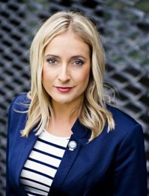

Piotr Kozak | Chief Executive Officer 
 
Obszary specjalizacji (zainteresowania): 
Technologie informatyczne, systemy ERP, rozwiązania programowe i sprzętowe, modelowanie danych, programowanie, integracja oprogramowania 
 
Wsparcie enova365: 
Całość oprogramowania enova365 – najwyższy poziom ekspercki 
 
Języki: Polski
 

 

Karolina Hudowicz 
 
Ekspert w zakresie zarządzania zasobami ludzkimi, przywództwa, komunikacji zespołowej oraz motywacji. Specjalizuje się w transformacjach organizacji w oparciu o metody i narzędzia coachingowe pogłębiające wgląd w siebie oraz badające poziomy świadomości ludzi i organizacji. Prowadzi wiele warsztatów motywacyjnych i budujących świadomość własnych obszarów do rozwoju, zasobów i wartości a także leadership i teambuilding  oraz szeroko rozumianej komunikacji także w języku angielskim. Jako pasjonatka gór, instruktor narciarstwa alpejskiego i snowboardzistka, organizuje i prowadzi szkolenia outdoorowe w oparciu o symulacje ratowania życia ludzkiego w lawinach śnieżnych, jaskiniach oraz na ścianach skalnych przy współpracy z ratownikami GOPR Beskidy. Prowadzi coaching grupowy i zespołowy oraz indywidualny głównie w środowiskach biznesowych. Posiada ponad 2000 godzin praktyki trenerskiej na sali szkoleniowej, ponad 1800 godzin sesji coachingowych. Jest ekspertem i doradcą w zakresie strategii rozwojowych i HR-owych. 

